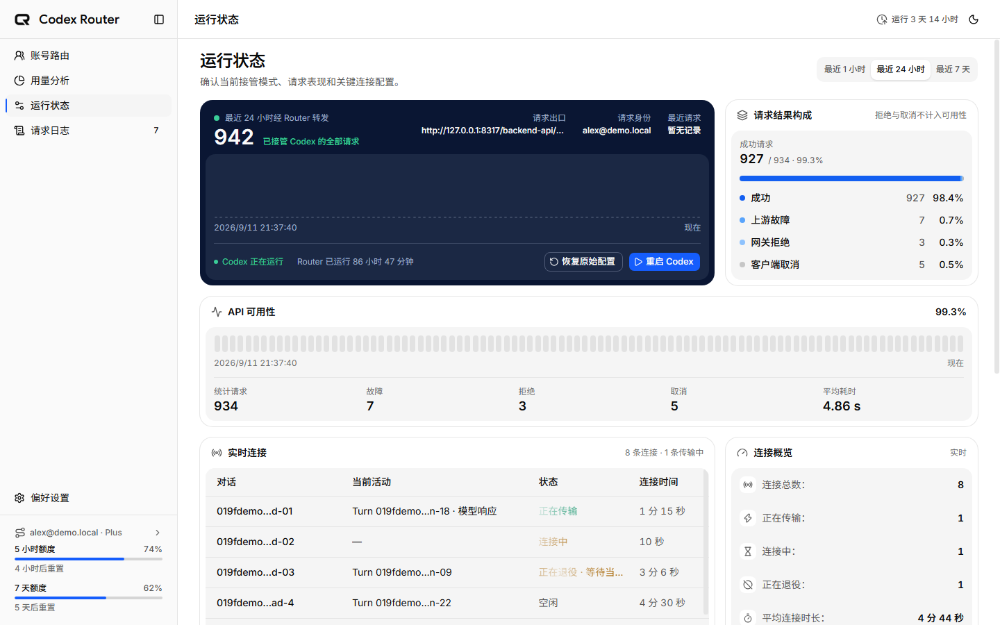

<p align="center">
  <picture>
    <source media="(prefers-color-scheme: dark)" srcset="assets/branding/codex-router-logo-dark.png">
    <source media="(prefers-color-scheme: light)" srcset="assets/branding/codex-router-logo.png">
    
  </picture>
</p>

<h1 align="center">Codex Router</h1>

<p align="center">
  面向 Codex CLI 的本机多账号路由器与透明代理。
  <br>
  隔离管理账号，按需开启自动切换与额度预热，并在不记录数据面正文的前提下保留可核验的请求证据。
</p>

<p align="center">
  <a href="https://github.com/Aurora0201/codex-router/actions/workflows/ci.yml"></a>
  <a href="https://github.com/Aurora0201/codex-router/actions/workflows/codeql.yml"></a>
  <a href="https://www.npmjs.com/package/@aurora0201/codex-router"></a>
  <a href="https://github.com/Aurora0201/codex-router/releases"></a>
  
  <a href="LICENSE"></a>
</p>

<p align="center">
  <a href="#快速开始">快速开始</a> ·
  <a href="#核心能力">核心能力</a> ·
  <a href="#工作方式">工作方式</a> ·
  <a href="#命令行">命令行</a> ·
  <a href="#安全边界">安全边界</a> ·
  <a href="docs/releasing.md">发布指南</a>
</p>

> [!IMPORTANT]
> Codex Router 只监听本机地址。默认由你手动选择账号；自动切换和自动预热均需显式开启。预热会实际消耗所选账号的额度，不会增加或重置官方额度，也不保证请求可用。

## 产品预览

<p align="center">
  
</p>

## 核心能力

| 能力 | 说明 |
|---|---|
| 隔离账号路由 | 每个已授权账号维护独立 `CODEX_HOME`，新请求使用当前选定身份；默认手动，可选择开启有记录的自动切换。 |
| 额度窗口预热 | 对参与预热的账号发送一次小型 Turn，尝试启动五小时窗口；提供冷却、每日自动次数上限及窗口确认记录。 |
| 透明协议代理 | 透明转发 Codex HTTP、SSE、WebSocket、remote compact、model catalog 与 web search 请求，不重写 Responses 数据。 |
| 安全登录隔离 | 使用 OpenAI 官方 Browser OAuth；凭据保存在账号专属目录，不写入 SQLite。 |
| 实时运行观测 | 展示当前接管链路、API 可用性、活动 WebSocket、对话/Turn 关联和连接状态。 |
| 请求证据中心 | 区分请求生命周期、HTTP 状态、协议错误与连接诊断，避免把 WebSocket `101` 当成请求成功。 |
| CLI 与管理后台 | 提供启停、状态、账号选择、日志和 Codex 配置注入命令，并附带本地 Web 管理界面。 |

## 快速开始

当前正式发布包支持 **Windows x64**，需要 **Node.js 24+**。

```powershell
npm install --global @aurora0201/codex-router
codex-router start
```

打开 [http://127.0.0.1:8317/admin/](http://127.0.0.1:8317/admin/)，点击“添加账号”，在 OpenAI 官方 OAuth 页面完成登录，然后手动选择当前路由账号。

将 Codex 配置指向本地 Router：

```toml
openai_base_url = "http://127.0.0.1:8317/backend-api/codex"
```

也可以让 CLI 自动注入并保留可恢复备份：

```powershell
codex-router config apply
codex-router restart
codex-router status
```

之后照常运行 Codex。账号池为空时，Router 会保留 Codex 当前登录身份直接透传，避免安装或升级后阻断请求。

## 工作方式

```text
Codex CLI
    │ HTTP / SSE / WebSocket
    ▼
Codex Router（127.0.0.1）
    │ 注入当前选定账号的认证
    ▼
OpenAI Codex upstream
```

- 默认手动选择账号，不按请求分配身份；开启自动切换后，可根据额度与账号状态更新当前账号，不会将同一失败请求改道重试。
- 切换账号后，新 HTTP 请求立即使用新账号。
- 旧账号的空闲 WebSocket 会立即退役；正在传输的连接会在协议终态完成后退役。
- Router 的代理链路不执行工具、不保存 Prompt、工具参数、工具结果或响应正文；认证刷新由账号隔离的官方 app-server 处理。
- 当前兼容基线为官方 Codex CLI `0.147.0`；项目通过依赖锁文件固定实际安装版本。

### 自动切换与预热

两项功能独立控制，默认关闭；账号也可以单独退出参与。

- **自动切换**：额度或认证状态变化后评估账号池，并通过与手动选择相同的流程切换身份。周额度耗尽的账号不会参与自动选择，进行中的请求不会被切断。
- **自动预热**：Router 启动、窗口到期、休眠恢复、设置变化及额度刷新后进行评估。外部重置没有推送来源时依靠轮询发现，不保证即时触发；到期先刷新核验，不凭旧读数发送。
- **结果确认**：发送前记录尝试；只有读取到窗口运行才显示成功。Turn 已完成但窗口未确认时显示“待确认”，不会因此自动重复发送。
- **消费保护**：自动预热有每账号冷却和滚动 24 小时次数上限；确认重置可解除旧冷却，但不放宽次数上限。手动强制预热仍会消费额度，也不会绕过周额度耗尽限制。

> [!NOTE]
> 预热通过账号专属 app-server 直连上游，不经过代理、不改变当前路由账号，因此在预热记录中查看结果，而不是请求日志。官方额度何时更新仍以上游实际返回为准。

### 升级到 0.2.1

先停止 Router，并备份完整数据目录（包括数据库和账号目录），再更新并重启：

```powershell
codex-router stop
npm install --global @aurora0201/codex-router@0.2.1
codex-router start
codex-router --version
```

若启用了 Windows 登录自启动，升级后重新执行 `codex-router startup enable`。数据迁移在启动时执行；降级前应停止 Router 并恢复对应版本的完整备份，不要直接用旧版本打开升级后的数据库。

## 命令行

| 命令 | 说明 |
|---|---|
| `codex-router start` | 后台启动网关，日志写入 `<data-dir>/logs/gateway.log`。 |
| `codex-router start --foreground` | 前台运行并持续输出日志。 |
| `codex-router status` | 查看管理地址、PID、运行时间、配置状态、当前账号和剩余额度。 |
| `codex-router account [account-id]` | 交互选择账号，或按完整账号 ID 直接切换。 |
| `codex-router stop` | 优雅停止后台进程。 |
| `codex-router restart` | 使用上次成功启动参数优雅重启。 |
| `codex-router logs [--tail]` | 查看或持续跟随日志文件。 |
| `codex-router config status/apply/restore` | 查看、注入或还原 Codex 的本地 Router 配置。 |
| `codex-router startup enable/disable/status` | 启用、关闭或查看当前用户登录自启动（仅 Windows）。 |

常用启动参数包括 `--host`、`--port`、`--data-dir`、`--log-level` 和 `--log-file`。自定义 `--upstream` 必须同时启用 `--dev`，避免将认证意外发送到不可信服务。

### Windows 登录自启动

通过任务计划程序在当前用户登录后自动启动，不需要管理员权限：

```powershell
codex-router startup enable
codex-router startup status
```

任务复用最近一次成功启动保存的 host、port、data-dir 和日志参数，所以自启动的网关和你手动启动的是同一个。**修改启动参数、升级或移动安装路径后要重新运行 `startup enable`**——任务里记的是绝对路径。

`startup status` 会报告任务上一次运行的结果。这一条是有来历的：任务状态显示 "Ready" 并不代表它启动成功，只有 `LastTaskResult` 知道真相，而它曾经连续几周每次登录都失败而无人察觉。

任务运行的是前台模式的网关——任务进程本身就是网关，由任务计划程序负责失败重启。日志追加到 data-dir 下的 `logs/gateway.log`。

关闭自启动不会停止正在运行的网关：

```powershell
codex-router startup disable
codex-router stop
```

这是**用户登录自启动**，不是 Windows 系统服务：无人登录时 Router 不运行。

## 管理后台

- **账号路由**：管理隔离账号、选择当前身份、查看额度，并配置自动切换与预热。
- **运行状态**：查看接管链路、API 可用性和活动 WebSocket 连接。
- **请求日志**：分别查询请求证据与 WebSocket 连接诊断，支持筛选、分页和详情检查。
- **偏好设置**：切换主题与语言、调整安全元数据日志等级、复制本地环境路径。

管理后台由 Router 本身托管，不需要单独部署前端服务。

## 安全边界

> [!NOTE]
> 数据面保持不透明。结构化日志只保存排障所需的状态、时间、路由和白名单协议元数据。

- 仅监听 `127.0.0.1` 或 `::1`，不提供公网通用代理。
- 数据面严格白名单：`/responses`、`/responses/compact`、`/models` 与支持的 web search 路由；其他路径返回 `501`。
- 拒绝携带浏览器 `Origin` / `Referer` 的数据面请求；管理写操作要求同源、SameSite Cookie 和 CSRF token。
- 托管账号模式替换客户端认证，剥离 Cookie 和 hop-by-hop headers；空账号池透传模式保留客户端认证，不注入其他账号身份。
- Prompt、响应正文、工具参数、工具输出、Authorization、Cookie 不进入日志或 SQLite。
- `401` 只刷新并重试同一账号一次；`429` 原样返回，不跨账号重试当前请求。显式开启自动切换后，后续请求可能使用重新选定的账号。
- 账号凭据只保存在 `<data-dir>/accounts/<id>/codex-home/`；SQLite 不保存 access、refresh 或 ID token。

完整约束以 [透明身份代理 ADR](docs/adr/0001-transparent-identity-proxy.md) 为准。

## 配置

| 环境变量 | 默认值 | 说明 |
|---|---|---|
| `GATEWAY_HOST` | `127.0.0.1` | 仅接受本机回环地址。 |
| `GATEWAY_PORT` | `8317` | Gateway 与管理后台端口。 |
| `GATEWAY_DATA_DIR` | `env-paths("codex-router").data` | 数据库、隔离账号和登录暂存目录。 |
| `CODEX_ROUTER_CLI` | 锁定的官方 npm CLI | 可显式指定 Codex 可执行文件。 |
| `GATEWAY_LOG_LEVEL` | `info` | Fastify / Pino 日志等级。 |

运行 `codex-router status` 可以查看当前实际数据目录和日志位置。

### 从源码版迁移

旧版源码运行默认使用仓库中的 `data/`。发布包不会自动移动凭据目录；升级时可以继续指定旧目录：

```powershell
codex-router start --data-dir D:\path\to\codex-router\data
```

也可以在网关停止后，将整个旧 `data/` 目录复制到 `codex-router status` 显示的系统数据目录。迁移前请保留备份，不要只复制数据库而遗漏账号目录。

## 从源码开发

```powershell
git clone https://github.com/Aurora0201/codex-router.git
cd codex-router
npm install
npm run dev
```

构建和验证：

```powershell
npm test
npm run lint
npm run build
npm run test:e2e
```

如需在仓库内直接使用 CLI：

```powershell
npm run build
node server/dist/cli.js --help
```

也可以执行一次 `npm link`，之后通过全局 `codex-router` 命令运行本地构建。

## 兼容性与发布

- 当前兼容基线：Node.js `24.x`、Codex CLI `0.147.0`。
- 版本由 Release Please 根据 Conventional Commits 维护。
- GitHub Release 同时提供 npm tarball、Windows x64 ZIP 和 `SHA256SUMS.txt`。
- 维护者流程见 [docs/releasing.md](docs/releasing.md)，兼容性检查见 [docs/compatibility.md](docs/compatibility.md)。

## License

[MIT](LICENSE)
