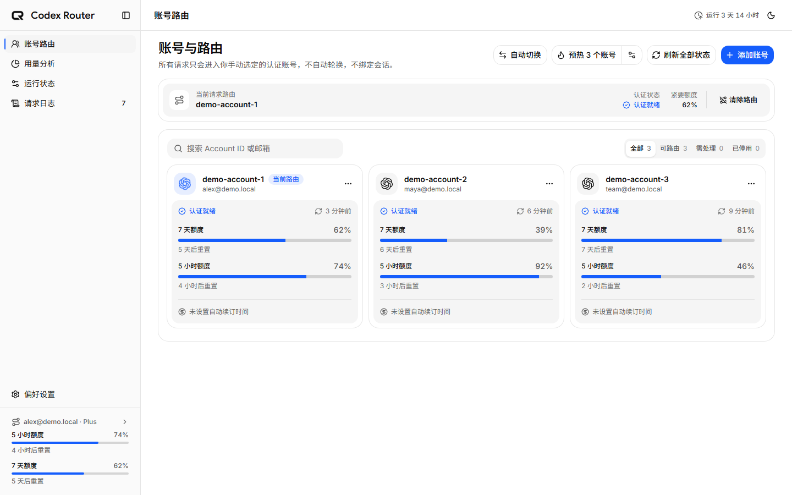
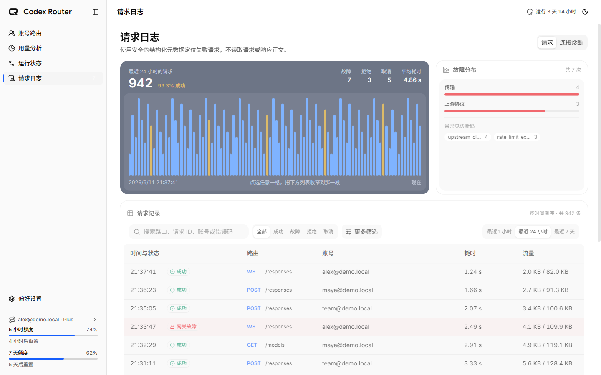

<p align="center">
  <picture>
    <source media="(prefers-color-scheme: dark)" srcset="assets/branding/codex-router-logo-dark.png">
    
  </picture>
</p>

<h1 align="center">Codex Router</h1>

<p align="center">
  Codex CLI 的本机多账号路由器与运行观测台。<br>
  隔离管理身份，掌握额度窗口，追踪流式请求，让每次切换和失败都有据可查。
</p>

<p align="center">
  <strong>简体中文</strong> · <a href="README.en.md">English</a>
</p>

<p align="center">
  <a href="https://github.com/Aurora0201/codex-router/actions/workflows/ci.yml"></a>
  <a href="https://github.com/Aurora0201/codex-router/actions/workflows/codeql.yml"></a>
  <a href="https://www.npmjs.com/package/@aurora0201/codex-router"></a>
  <a href="https://github.com/Aurora0201/codex-router/releases"></a>
  
  <a href="LICENSE"></a>
</p>

<p align="center">
  <a href="#quick-start">快速开始</a> · <a href="#界面预览">界面预览</a> · <a href="#features">功能介绍</a> ·
  <a href="#architecture">工作原理</a> · <a href="#privacy">安全与隐私</a> ·
  <a href="#cli">命令行</a> · <a href="#faq">常见问题</a>
</p>

> [!IMPORTANT]
> 当前发布包支持 **Windows x64 / Node.js 24+**。自动切换和自动预热默认关闭，需显式开启；预热会真实消耗账号额度。Router 不提供订阅、额外额度或官方限制的豁免。

## 项目介绍

Codex Router 在 Codex CLI 与官方 Codex 后端之间增加一个本地透明代理。你可以管理多个已授权账号，明确选择下一次请求使用的身份，并在管理后台查看额度、连接、请求结果和本地用量。

它适合需要长期使用 Codex、管理独立账号，以及排查 HTTP/SSE/WebSocket 失败的用户。日常操作集中在一个本机界面中；无需为了切换代理身份反复替换主 Codex 登录文件。

所有预览均由当前前端使用虚构演示数据生成，不包含真实邮箱、账号 ID、请求 ID、本地路径或凭据。

## 界面预览

### 运行状态

<p align="center">
  
</p>

集中确认 Codex 是否由 Router 接管，并在同一视图查看请求趋势、结果分布、API 可用性与活动 WebSocket。连接按传输中、连接中/退役中、空闲稳定分组，适合快速判断网关当前是否健康。

### 账号路由

<p align="center">
  
</p>

每个账号拥有独立身份目录和额度状态；当前路由有明确标识。页面同时提供认证刷新、额度读取、自动切换和五小时窗口预热入口，但任何自动消费能力都需要用户主动启用。

### 请求证据

<p align="center">
  
</p>

请求日志与 WebSocket 连接诊断相互独立。你可以按时间、结果、传输方式和错误证据筛选，再通过详情面板核对 HTTP 状态、协议错误码、诊断码、失败来源与失败阶段，而无需读取 Prompt 或响应正文。

<a id="quick-start"></a>
## 快速开始

### 1. 安装与启动

安装 Node.js 24+ 后，在 PowerShell 中运行：

```powershell
npm install --global @aurora0201/codex-router
codex-router start
```

访问 <http://127.0.0.1:8317/admin/>。默认后台运行，使用 `codex-router start --foreground` 可前台查看日志。

也可从 [GitHub Releases](https://github.com/Aurora0201/codex-router/releases) 下载 Windows x64 ZIP，解压后通过 `codex-router.cmd` 使用。ZIP 仍需要系统安装 Node.js。

### 2. 添加并选择账号

在“账号路由”中添加账号，通过 OpenAI 官方 Browser OAuth 完成授权，再选择当前路由账号。每个账号拥有独立的 `CODEX_HOME`，不会覆盖主 Codex 的认证文件。

也可以从终端选择：

```powershell
codex-router account
```

### 3. 配置 Codex

推荐使用内置配置命令，它会先创建备份：

```powershell
codex-router config apply
codex-router restart
codex-router status
```

对应的 Codex 根级 TOML 配置为：

```toml
openai_base_url = "http://127.0.0.1:8317/backend-api/codex"
```

之后照常启动 Codex CLI。账号数据库完全为空时，Router 保留客户端身份透传；账号池非空但当前账号不可用时，会明确拒绝请求，避免隐式使用其他身份。

<a id="features"></a>
## 功能介绍

### 账号隔离与路由控制

- 使用官方登录流程添加账号，支持刷新状态、启用、禁用与移除。
- 查看账号短周期/周额度窗口、订阅信息及到期提示。
- 默认手动选择身份；HTTP 新请求使用进入网关时选定的账号。
- WebSocket 在握手时固定身份。切换后，空闲旧连接立即退役，传输中的连接等待协议终态后退役。
- 不将对话或 Turn 粘滞绑定到账号，不在现有连接中热替换认证。

### 可选自动切换

显式开启后，Router 根据额度刷新、认证状态变化和限额信号评估账号池，并通过与手动选择相同的路径更新当前身份。

| 规则 | 行为 |
| --- | --- |
| 默认状态 | 关闭，完全手动选择 |
| 参与范围 | 启用、认证就绪且允许参与的账号 |
| 周额度耗尽 | 从所有自动选择分支排除 |
| 进行中的请求 | 保持原身份，不跨账号重试 |
| 已有 WS 连接 | 按正常退役流程结束 |
| 每次切换 | 记录来源、目标、原因和判据 |

关闭自动切换后即恢复手动控制。`429` 仍原样返回当前请求，重新选定的账号只影响后续请求。

### 五小时窗口预热

预热用于尝试启动尚未运行的五小时窗口：通过账号专属官方 app-server 发送一次小型 Turn，然后刷新额度确认结果。可选择模型和推理强度，也可以配置简短预热消息。

- 自动预热默认关闭，每个账号需单独参与。
- Router 启动、窗口到期、休眠恢复、设置变化及状态刷新后进行评估。
- 官方/外部重置没有推送来源时，通过轮询发现，不保证瞬时触发。
- 到期后先读取最新额度；未知窗口、没有短窗口或周额度耗尽时不会自动发送。
- 默认冷却为 15 分钟，每账号滚动 24 小时最多 6 次自动尝试，可在设置中调整。
- 发送前记录尝试。Turn 完成且确认窗口运行才显示成功；未确认时显示“待确认”，继续读取额度，不自动重复发送。
- 明确的新重置可以解除旧冷却，但不放宽每日自动次数上限。
- 手动强制预热代表用户主动消费，仍受账号资格和周额度耗尽限制。

> [!NOTE]
> 预热直连官方后端，不经过代理，也不改变当前路由账号。结果在预热记录中查看，不计入代理请求日志。`generate:false` 的 Codex 协议预热与这里用于启动额度窗口的真实 Turn 是不同机制。

### 运行状态与活动连接

运行状态页集中展示接管链路、请求趋势、API 可用性和所有尚未关闭的 WebSocket 连接。

活动表以 connection ID 为唯一身份，展示对话/Turn 白名单标识、当前活动、连接状态与持续时间。同一对话可以有多条连接，同一连接也可以先后处理多个 Turn。

连接按“传输中 → 连接中/退役中 → 空闲”稳定排列；状态变化时进入对应分组前列。未知对话关联回退显示连接标识，连接数量增加时在固定区域内滚动。

### 请求日志与连接诊断

两类记录分别展示，支持服务端筛选、分页和结构化详情。

| 视图 | 可查看的证据 |
| --- | --- |
| 请求 | 生命周期、结果、HTTP 状态、协议错误码、诊断码、失败来源/阶段、上游请求 ID、耗时与字节数 |
| 连接诊断 | 握手 HTTP 状态、双方关闭码、关闭发起方、退役或关闭原因 |

请求开始时立即记录 `running`，首个可信终态原位更新同一行。重要判断规则：

- 普通 HTTP 端点以状态与传输完成判断结果；`/responses` 的 SSE 需要协议成功终态，HTTP 200 本身不足以证明成功。
- `response.completed` 表示成功；incomplete、failed、顶层 error 保留各自协议证据。
- 终态前断流或 EOF 记录传输失败；解析错误后若收到有效终态，仍以终态为准。
- 客户端取消单独归类，重启前遗留 running 更新为 interrupted。
- `101` 只表示 WS 握手成功；正常连接退役不增加请求错误数。
- 运行中的请求和连接记录不进入请求成功率。

### 本地 Codex 用量分析

用量页从主 `CODEX_HOME` 的本地 rollout 提取白名单计数与生命周期信息，展示趋势、模型/项目分布及任务活动。

- 这是**跨账号的本地聚合**，不是官方账单，也不能推导每个托管账号的剩余额度。
- 增量读取已完成记录，将累计 token 快照转换为增量，避免重复相加。
- 已扫描的统计在源历史确认消失后保留；此前未扫描的历史无法恢复。
- 使用独立用量数据库、完整性校验备份和恢复记录。
- 项目归属只保留哈希键与末尾两段路径标签，不保存完整工作目录。

详见 [本地用量 ADR](docs/adr/0002-local-codex-usage-analytics.md)。

### 本地管理体验

管理后台由 Router 托管，无需单独部署。支持中文/英文、深浅主题、实时 SSE 刷新、详情复制和本地目录路径复制。

<a id="architecture"></a>
## 工作原理

```text
Codex CLI
   │ HTTP / SSE / WebSocket
   ▼
Codex Router · 127.0.0.1:8317
   ├─ 当前账号身份与认证替换
   ├─ 数据面流式透明转发
   └─ 白名单生命周期与诊断元数据
   │
   ▼
官方 Codex 后端
```

数据面支持 Responses、remote compact、models 与 web search 路由。HTTP 请求体和代理响应按原始字节转发；Router 不实现模型推理或工具运行时。

`401` 最多刷新并重试同一账号一次。自动切换发生在请求之外，不会将失败请求换个账号重发。认证管理与可选预热使用账号隔离的官方 app-server。

<a id="privacy"></a>
## 安全与隐私

### 数据边界

| 范围 | 保存内容 |
| --- | --- |
| 请求与连接日志 | 时间、路由、身份模式、状态/结果、字节数与白名单错误证据 |
| 安全响应头 | `x-request-id`、`openai-request-id`、`retry-after` |
| 活动连接 | 安全 session/thread/turn ID，仅进程内保留，不新增到连接历史 |
| 用量分析 | 白名单计数、模型、任务事件与有限项目标签 |
| 用户配置 | 账号参与规则、阈值、模型/推理设置及用户主动设置的预热消息 |
| 认证文件 | 账号专属 `CODEX_HOME`，凭据不写入 Router SQLite |

代理日志和用量数据库不保存对话 Prompt、输入/响应正文、工具参数/结果、完整协议事件、认证头或 Cookie。诊断不保存上游错误 message/stack，也不允许任意 `x-*` 响应头。

这里的边界针对 Router 的日志与分析数据；官方 Codex 自身管理的文件仍遵循 Codex 的行为。自定义预热消息作为用户设置保存，请勿将敏感内容用作预热消息。

### 访问边界

- 只监听 `127.0.0.1` 或 `::1`。
- 默认上游固定为官方 Codex 后端；自定义上游需显式开启开发模式。
- 数据面限制为支持的路由，其他路径返回 501。
- 拒绝携带浏览器 Origin/Referer 的数据面请求；管理写操作使用同源、SameSite Cookie 与 CSRF token。
- 托管模式替换认证并过滤 Cookie；空账号池模式保留客户端认证。

完整规则见 [透明身份代理 ADR](docs/adr/0001-transparent-identity-proxy.md)。

<a id="cli"></a>
## 命令行

| 命令 | 说明 |
| --- | --- |
| `codex-router start [--foreground]` | 后台或前台启动 |
| `codex-router status` | 查看地址、PID、运行时间、配置与当前账号 |
| `codex-router account [account-id]` | 交互选择或指定账号 |
| `codex-router stop` | 优雅停止 |
| `codex-router restart` | 保留最近启动参数重启 |
| `codex-router logs [--tail]` | 查看或跟随日志 |
| `codex-router config status/apply/restore` | 查看、备份注入或恢复 Codex 配置 |
| `codex-router startup enable/disable/status` | 管理 Windows 登录自启动 |
| `codex-router --version` | 查看当前 CLI 版本 |

常用启动参数为 `--host`、`--port`、`--data-dir`、`--log-level`、`--log-file`；自定义 `--upstream` 必须与 `--dev` 一起使用。

### Windows 登录自启动

```powershell
codex-router startup enable
codex-router startup status
```

通过任务计划程序在当前用户登录后启动，不需要管理员权限。它是用户登录任务，不是无人登录也运行的系统服务。

任务记录安装路径与最近启动参数。升级、移动安装或修改参数后重新运行 `startup enable`。`startup status` 同时报告上次任务结果；关闭自启动不会停止已运行的网关。

## 配置与数据目录

| 环境变量 | 默认值/用途 |
| --- | --- |
| `GATEWAY_HOST` | `127.0.0.1` |
| `GATEWAY_PORT` | `8317` |
| `GATEWAY_DATA_DIR` | 系统应用数据目录；可显式指定 |
| `GATEWAY_LOG_LEVEL` | `info` |
| `GATEWAY_LOG_FILE` | 可指定日志文件，后台模式有默认路径 |
| `CODEX_ROUTER_CLI` | 覆盖内置 Codex 可执行入口 |
| `GATEWAY_UPSTREAM` | 官方地址；修改需 `GATEWAY_DEVELOPER_MODE=true` |

使用 `codex-router status` 查看实际目录。迁移或备份时应复制**完整数据目录**，包括数据库、账号目录与备份；仅复制 SQLite 不包含账号凭据。

## 升级与卸载

升级前停止网关并备份数据：

```powershell
codex-router stop
npm install --global @aurora0201/codex-router@latest
codex-router start
codex-router --version
```

启用了登录自启动时，升级后再次执行 `codex-router startup enable`。数据库在启动时迁移；降级请恢复对应版本完整备份。

从旧源码目录迁移时可继续指定 `--data-dir D:\path\to\codex-router\data`，或者停止网关后复制整个目录。

卸载前恢复 Codex 配置：

```powershell
codex-router config restore
codex-router startup disable
codex-router stop
npm uninstall --global @aurora0201/codex-router
```

npm 卸载不会自动删除应用数据；确认不再需要后再手动处理。

## 开发与贡献

```powershell
git clone https://github.com/Aurora0201/codex-router.git
cd codex-router
npm install
npm run dev
```

运行验证：

```powershell
npm test
npm run lint
npm run build
npm run test:e2e
npm run release:check
npm run pack:check
```

直接运行本地构建使用 `node server/dist/cli.js --help`。开发期可在 `server` 目录执行 `npm link`；CLI 使用构建产物，修改后需重新构建。验证发布包前应解除 link 并安装明确版本。

欢迎通过 [Issues](https://github.com/Aurora0201/codex-router/issues) 报告可复现问题。请提供版本、平台、复现步骤和安全诊断码，避免附带凭据或对话正文。提交使用 Conventional Commits；传输修改需通过网关 E2E。

## 兼容性与发布

兼容基线为 Windows x64、Node.js 24+、Codex CLI 0.147.0。实际依赖由锁文件固定。Release Please 管理版本和 CHANGELOG；GitHub Release 提供 tarball、Windows ZIP 和 SHA256 校验文件。

- [兼容性检查](docs/compatibility.md)
- [发布流程](docs/releasing.md)
- [更新记录](CHANGELOG.md)

<a id="faq"></a>
## 常见问题

**会合并账号额度或重置官方窗口吗？**

不会。每个请求归属于一个账号；预热尝试通过正常消费启动窗口，不能增加或重置官方配额。

**自动切换会重新发送失败请求吗？**

不会，只影响后续请求。正在使用旧身份的连接遵循正常退役规则。

**为什么 HTTP 200 的请求仍然失败？**

Responses SSE 的 HTTP 状态只说明响应头成功，流中仍可能返回协议错误或在成功终态前断开。

**为什么对话列有“未关联”？**

客户端未提供可用白名单标识时，Router 无法推导对话信息，会保留连接行并显示 connection ID。它不读取对话标题或预览。

**为什么预热一直“待确认”？**

上游尚未提供运行中窗口的证据。可检查额度刷新与预热记录；Router 不会自动重复发送来猜测是否生效。

**用量页为什么没有账号筛选？**

主 Codex 历史可能跨路由身份，无法可靠归属托管账号，因此只呈现本机聚合，不用于账单或额度判断。

## License

[MIT](LICENSE)
